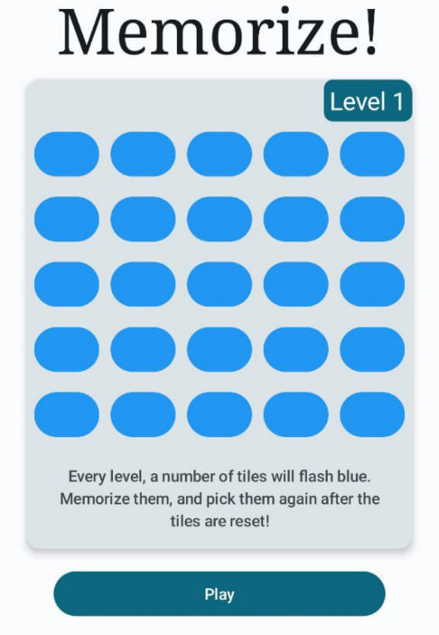
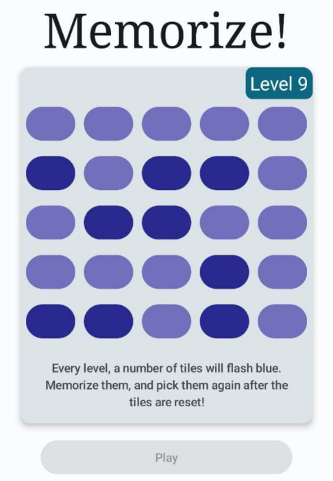
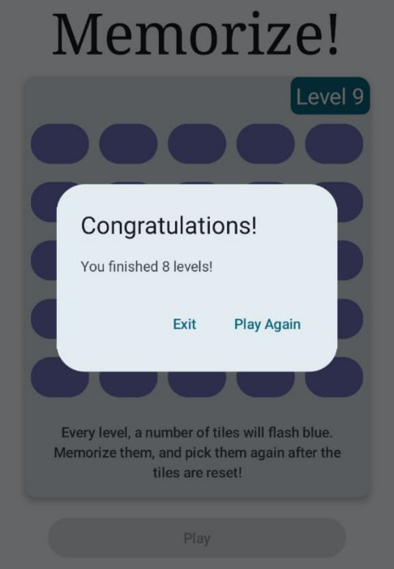

## Android simple memory game.
### In the game, at every nth level n buttons light up, after which the user must repeat them. The sequence of clicks is not important. Maximum level - 25

  
  
  

#### Created with using Jetpack Compose, ViewModel, MVVM pattern, Coroutines, ViewModelScope. 
#### App is written in the Kotlin.

